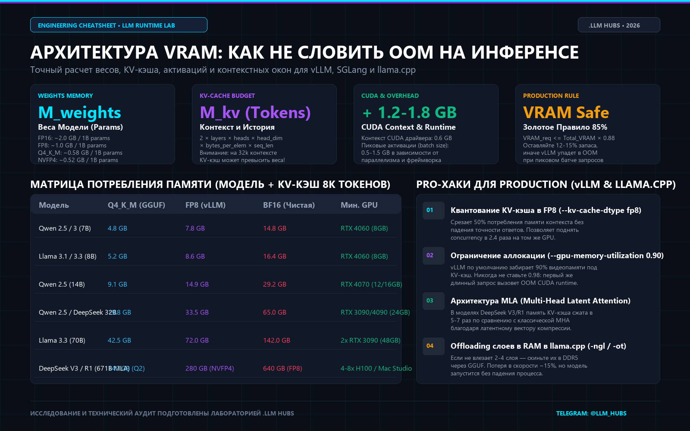

# ⚡ LLM VRAM Calculator & Inference Speedtest

[](https://t.me/llm_hubs)
[](https://python.org)
[](LICENSE)
[-brightgreen?style=for-the-badge)](vram_calc.py)

Легковесная автономная CLI-утилита без внешних зависимостей (pure Python stdlib) для:
1. **Точного расчета видеопамяти (VRAM)** под любую открытую модель (7B–671B): веса модели ($M_{weights}$), аппетит динамического KV-кэша ($M_{kv}$), контекстные окна (4k–128k токенов), активации и оверхед CUDA.
2. **Спидтеста локального и облачного инференса** (vLLM, llama.cpp, Ollama, SGLang, OpenAI API) с замером **TTFT** (Time to First Token) и **TPS** (Tokens/sec).

Разработано исследовательской лабораторией Telegram-канала [**.llm hubs**](https://t.me/llm_hubs).

---



---

## 🛑 Почему происходят CUDA Out of Memory (OOM)?

90% сбоев при запуске локальных LLM происходят потому, что инженеры учитывают только «сухой вес» модели из репозитория Hugging Face. 

Реальная видеопамять складывается из трёх слагаемых:
$$\text{Total VRAM} = M_{\text{weights}} + M_{\text{kv-cache}} + \text{CUDA Overhead} + \text{Peak Activations}$$

* **Веса ($M_{weights}$):**
  * `FP16 / BF16`: ~2.0 ГБ на каждый 1B параметров
  * `FP8`: ~1.0 ГБ на каждый 1B параметров
  * `Q4_K_M (GGUF)`: ~0.58 ГБ на каждый 1B параметров
  * `NVFP4`: ~0.52 ГБ на каждый 1B параметров
* **KV-Кэш ($M_{kv}$):** 
  $$M_{\text{kv}} = 2 \times \text{layers} \times \text{kv\_heads} \times \text{head\_dim} \times \text{bytes\_per\_elem} \times \text{seq\_len} \times \text{batch\_size}$$
  *На контексте 32,768 токенов в FP16 один лишь KV-кэш для 7B модели съедает **4.2 ГБ VRAM**!*
* **Оверхед CUDA:** ~650–850 МБ под контекст драйвера PyTorch / CUDA + буферы активаций.

---

## 🚀 Быстрый старт (Zero Setup)

Скрипт использует **только стандартную библиотеку Python**. Никаких `pip install` не требуется.

```bash
# Клонируйте репозиторий
git clone https://github.com/DangerousANEN/llm-vram-calculator.git
cd llm-vram-calculator

# 1. Рассчитать VRAM для 7B модели (квантование Q4_K_M, контекст 8192 токена)
python vram_calc.py calc --params 7 --quant q4_k_m --ctx 8192

# 2. Рассчитать VRAM для 32B модели под продакшен (batch size = 4, FP8 KV-кэш)
python vram_calc.py calc --params 32 --quant fp8 --ctx 16384 --batch 4 --kv-quant fp8

# 3. Рассчитать DeepSeek V3 / R1 (671B с архитектурой сжатия MLA)
python vram_calc.py calc --params 671 --quant nvfp4 --ctx 32768 --mla
```

### Пример вывода:
```text
==================================================
 🧮 VRAM ALLOCATION REPORT: 7.0B (Q4_K_M)
==================================================
 • Веса модели (Weights):         3.78 GB
 • KV-Кэш (8192 токенов, b=1):     1.06 GB (kv=fp16)
 • CUDA Overhead + Активации:    0.81 GB
--------------------------------------------------
 • ИТОГО Потребление:            5.65 GB
 • Рекомендуемый размер GPU:         7 GB VRAM
==================================================
```

---

## ⚡ Спидтест инференса (TTFT & Tokens/sec)

Утилита умеет напрямую замерять реальную скорость отдачи токенов на любом OpenAI-совместимом эндпоинте (vLLM, llama-server, Ollama, LM Studio, TGI):

```bash
# Замер локального сервера vLLM
python vram_calc.py bench --url http://localhost:8000/v1 --model meta-llama/Llama-3.3-70B-Instruct

# Замер Ollama
python vram_calc.py bench --url http://localhost:11434/v1 --model qwen2.5:7b
```

Вывод замера:
```text
==================================================
 ⚡ INFERENCE SPEEDTEST REPORT: qwen2.5:7b
==================================================
 • TTFT (Time to First Token):    142.3 ms
 • Скорость генерации (TPS):      64.20 tok/s
 • Всего токенов:                   120 tokens
 • Общее время:                    1.87 s
==================================================
```

---

## 📊 Матрица моделей и минимальные требования GPU

| Модель | Параметры | Q4_K_M (GGUF) | FP8 (vLLM) | BF16 (Чистая) | Мин. рекомендуемый GPU |
| :--- | :---: | :---: | :---: | :---: | :--- |
| **Qwen 2.5 / 3** | 7B | 4.8 GB | 7.8 GB | 14.8 GB | RTX 4060 (8 GB) |
| **Llama 3.1 / 3.3** | 8B | 5.2 GB | 8.6 GB | 16.4 GB | RTX 4060 (8 GB) |
| **Qwen 2.5** | 14B | 9.1 GB | 14.9 GB | 29.2 GB | RTX 4070 (12/16 GB) |
| **Qwen 2.5 / DeepSeek** | 32B | 19.8 GB | 33.5 GB | 65.0 GB | RTX 3090 / 4090 (24 GB) |
| **Llama 3.3** | 70B | 42.5 GB | 72.0 GB | 142.0 GB | 2× RTX 3090 (48 GB) |
| **DeepSeek V3 / R1** | 671B (MLA) | 140 GB | 280 GB | 640 GB | 4-8× H100 / Mac Studio |

*(Расчет дан с учетом KV-кэша на 8,192 токена)*

---

## 💡 4 Production-Хака для предотвращения OOM

1. **Квантование KV-кэша в FP8 (`--kv-cache-dtype fp8` в vLLM):** срезает размер кэша ровно в 2 раза без деградации рассуждений и удваивает допустимый batch size.
2. **Лимит утилизации памяти (`--gpu-memory-utilization 0.88`):** никогда не выставляйте 0.98 на проде: первый же всплеск активаций при длинном запросе уронит воркер в OOM.
3. **Multi-Head Latent Attention (MLA):** модели семейства DeepSeek V3/R1 сжимают KV-кэш в 5–7 раз за счет низкоранговой проекции латентного вектора $c_t$.
4. **Сброс слоев в RAM в llama.cpp (`-ngl` / `-ot`):** если для модели не хватает 1–2 ГБ VRAM, сбросьте 4–6 слоев в оперативную память. Скорость упадет всего на 10–15%, но сервис не упадет.

---

## 📢 Сообщество и исследования

Больше практических инженерных гайдов, разборов архитектур нейросетей, бенчмарков железа и свежих открытых инструментов — в Telegram-канале:

👉 **[Подписаться на .llm hubs (@llm_hubs)](https://t.me/llm_hubs)**

---

## Лицензия

Распространяется под лицензией MIT. Подробности в файле [LICENSE](LICENSE).
